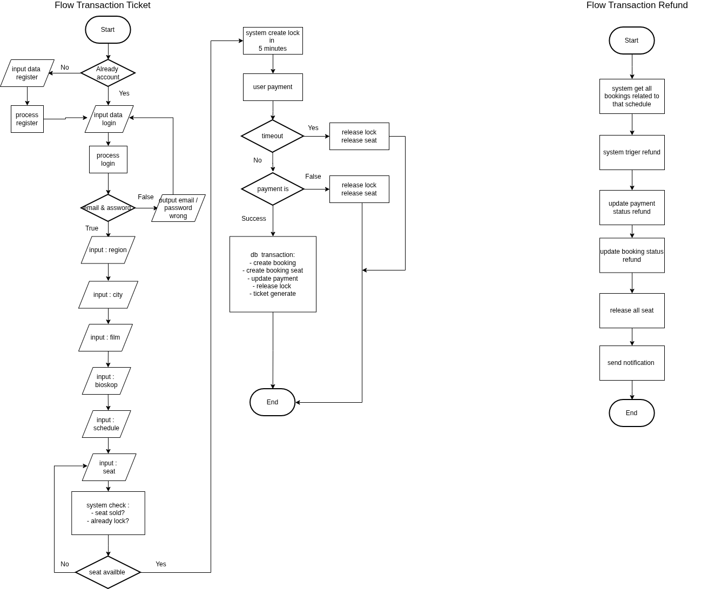
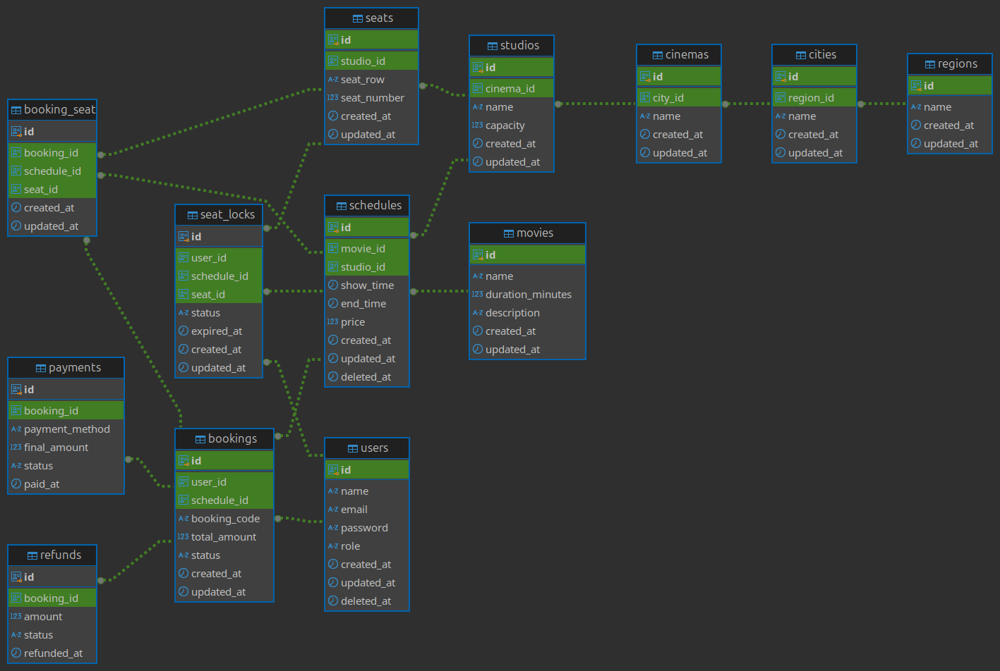

# Bioskop Ticket

Tech Stack :
- 
- 
- 
- 

Name : Feri Susmiyanto

Flow System Design :



ERD : 



## Set up local :

- Clone repo
- Rename file config.yml.example to config.yml
- Database use is Postgresql only
- Change the contents of the config.yml file according to the database name, username, password, host, port.
  ```bash
   postgres:
   host: "127.0.0.1"
   port: "5432"
   username: "postgres"
   password: "Terserah123"
   dbname: "mkp_ticket"
   idleconnect: 10
   maxconnect: 100
   lifeconnect: 300
  ```

- Run in terminal

  ```bash
  go run cmd/main.go
  ```
- Import file query-insert.sql to database for insert data
- account :
   - admin : 
      ```
      email : admin@email.com
      password : 123456789
      ```
  - customer : 
      ```
      email : user1@email.com
      password : 12345678
      ```
- URL Documentation API : https://documenter.getpostman.com/view/22397647/2sBXqQGHxw
